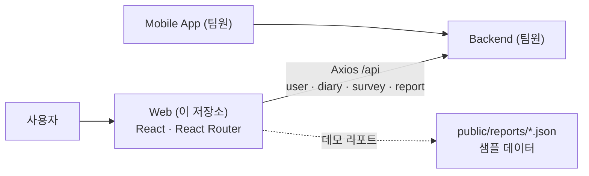

# ReConnect — 연인과 함께 쓰는 감정 다이어리 (Web Frontend)

> 연인이 같은 질문에 각자 답하고 서로의 답변을 확인하며, 답변을 바탕으로 한 **관계 분석 리포트**를 볼 수 있는 서비스의 **웹 프론트엔드** 저장소입니다.


| 항목 | 내용 |
|---|---|
| 기간 | 2025.09 ~ 2025.12 |
| 유형 | 교내 상상기업 (팀 프로젝트) |
| 팀 구성 | 4명 |
| 내 역할 | **웹 프론트엔드 전담** (모바일 앱·백엔드는 다른 팀원 담당) |

---

## 핵심 기능

1. **회원가입 · 로그인**: 세션 쿠키(`withCredentials`) 기반, 요청 인터셉터로 저장된 토큰도 함께 첨부
2. **커플 연결**: 커플 코드로 상대방과 연결
3. **초기 설문 · 오늘의 질문**: 36개 질문에 차례로 답하고 다음 질문으로 바로 이동
4. **답변 확인**: 내 답변 이력과 상대방 답변, 상대의 완료·대기 상태 확인
5. **관계 분석 리포트**: 파트별 리포트와 최종 리포트 화면 (현재는 데모용 샘플 JSON으로 렌더링)

<!-- 스크린샷 자리: 랜딩 / 질문 화면 / 답변 비교 / 리포트 -->

---

## 구조



- **API 호출을 서비스 계층(`services/reconnect.js`)으로 모았습니다.** 페이지 컴포넌트에서 엔드포인트를 직접 다루지 않게 했습니다.
- **Axios 인스턴스 하나로 인증과 에러 처리를 모았습니다.** 요청 인터셉터에서 인증 정보를 붙이고, 응답 인터셉터에서 실패한 요청의 URL·상태·응답을 공통으로 로깅합니다.

---

## 기술 스택

| 영역 | 기술 |
|---|---|
| Frontend | React 19 (CRA), React Router 7, Axios, react-calendar |
| 개발 환경 | CRA dev server proxy → `localhost:8080` |

---

## 내가 맡은 일
- 웹 화면 전체 구현: 랜딩, 로그인·회원가입, 홈, 초기 설문, 질문, 답변 보기, 커플 연결, 파트/최종 리포트
- Axios 인스턴스·인터셉터와 API 서비스 계층(`services/reconnect.js`) 구성
- 리포트 화면: AI 분석 결과 형식(JSON)을 받아 차원별 점수와 인사이트로 렌더링

**팀원**: 모바일 앱, 백엔드 API

<!--
## 트러블슈팅
### AI 분석 결과 렌더링
- 문제: AI 분석 결과의 데이터 구조가 복잡해 렌더링이 꼬였음
- 원인: (확인 필요)
- 해결: (확인 필요)
- 배운 점: (확인 필요)
-->

---

## 실행 방법

```bash
git clone https://github.com/alberione1110/ReConnect.git
cd ReConnect/web
npm install
npm start          # http://localhost:3000
```

- `/api` 요청은 CRA 개발 서버 프록시(`package.json`의 `proxy`)를 통해 `localhost:8080` 백엔드로 전달됩니다.
- 백엔드 없이도 화면 구성과 샘플 리포트(`public/reports`)는 확인할 수 있습니다.

---

## 폴더 구조

```text
web/
├─ public/
│  ├─ questions36.json        # 질문 데이터
│  ├─ initial_survey.json
│  └─ reports/                # 데모용 샘플 리포트 (실사용자 데이터 아님)
└─ src/
   ├─ pages/                  # Landing, Login, Signup, Home, Question, ViewAnswers, CoupleConnect, PartReport, FinalReport ...
   ├─ components/Header.js
   └─ services/reconnect.js   # Axios 인스턴스, 인터셉터, API 호출 모음
```
